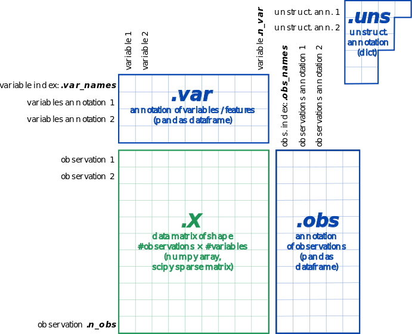

# mishima2019


# Single Cell
Single Cell RNA-seq解析では一細胞のみを解析対象とすることで、細胞集団単位の解析では埋もれてしまっていた少数派細胞の発現状態を検出することができます。そのため細胞の発生過程や細胞系譜(cell lineage)を明らかにすることに向いています。
<a href="https://bonohu.github.io/cellfishing.html">坊農秀雅先生のブログ</a>を参考にしました。
CellFishingでは、scRNA-seqで得たデータに適合するデータを検索することができます。

```
# Install Julia
brew cask install julia
# Install CellFishing
julia -e 'using Pkg; Pkg.add(PackageSpec(url="https://github.com/bicycle1885/CellFishing.jl.git"))'

https://github.com/bicycle1885/CellFishing.jl.git

# Run test for CellFishing
julia -e 'using Pkg; Pkg.test("CellFishing")'
# git clone CellFishing
git clone https://github.com/bicycle1885/CellFishing.jl
# Install zstd via Homebrew
brew install -v zstd

# Install required packages in julia
julia -e 'using Pkg; Pkg.add("HDF5")'
julia -e 'using Pkg; Pkg.add("DocOpt")'

# Getting data for the search
curl -O http://bimsbstatic.mdc-berlin.de/rajewsky/PSCA/all_sgete_4GU75.loom.gz
gzip -dc all_sgete_4GU75.loom.gz > Plass2018.dge.loom

# Run CellFishing
./bin/cellfishing build Plass2018.dge.loom
./bin/cellfishing search Plass2018.dge.loom.cf Plass2018.dge.loom >neighbors.tsv

```

<a href = "https://hemberg-lab.github.io/scRNA.seq.course/index.html">scRNA.seq.course</a>をやってみました。

### 3 Processing Raw scRNA-seq Data

##### 3.1 FastQC
single-cell RNA-seqデータ解析においても最初はクオリティチェックを行います。今回は遺伝研で貸していただいたMacBook Airで実行を行なったので、ツールのインストールもやっていきます。
```
conda install -c biobuilds fastqc
```
データセットは(Kolodziejczyk et al. 2015)のmESCのデータセットを使います。
シーケンサーはSMART-seq2、ペアエンドです。
(ERR522959_1.fastq, ERR522959_2.fastq)のデータをwgetでダウンロードします。shareというディレクトリを作って、そこにデータをダウンロードします。

```
mkdir share
cd share
wget ftp://ftp.sra.ebi.ac.uk/vol1/fastq/ERR522/ERR522959/ERR522959_1.fastq.gz
wget ftp://ftp.sra.ebi.ac.uk/vol1/fastq/ERR522/ERR522959/ERR522959_2.fastq.gz
gunzip ERR522959_1.fastq.gz
gunzip ERR522959_2.fastq.gz
cd ..
```

FastQCを実行していきます。
```
mkdir fastqc_results
fastqc -o fastqc_results Share/ERR522959_1.fastq Share/ERR522959_2.fastq
```

##### 3.2 Trimming Reads
Trim Galoreというソフトウェアを使って不要なリードをトリミングしていきます。
不要なリードとはアダプターやクオリティの低いリードのことです。Trim Galoreのインストールから行なっていきます。
```
conda install -c bioconda trim-galore
```
Trim Galoreを実行していきます。
```
mkdir fastqc_trimmed_results
trim_galore --nextera -o fastqc_trimmed_results Share/ERR522959_1.fastq Share/ERR522959_2.fastq
```
ドキュメントには次にSTARかkallistoでマッピングするようになっていますが、MacBook AirのメモリではSTARを実行できないので、Kallistoを使っていきます。ところで、STARはアライナーである一方で、Kallistoはpseudo-アライナーでアルゴリズムが異なっています。また、STARがリファレンスゲノムにマッピングするのに対し、kallistoではトランスクリプトームにマッピングします。まずはインストールを行います。
```
conda install -c bioconda kallisto
```
##### 3.6.3 Kallisto’s pseudo mode
kallistoのpseudoモードではsingle-cell RNA-seq実験のデータをpseudoアライメントすることができます。
kallitoでは遺伝子ではなくsplice isoformにマッピングしていており、single-cell RNA-seqにおいて次のような理由で難しさが出てきます。
・Single-cell RNA-seqはbulk RNA-seqよりもcoverageが少ない。
・Single-cell RNA-seqプロトコルは3'coverage biasがあるので5'末端のみが異なるisoform同士の場合、判別できない。
・ショートリードのみを使うものではisoform判別が難しくなる。

kallistoを実際に使っていきます。インデックスを作るためのトランスクリプトFASTAは<a href="https://github.com/hemberg-lab/scRNA.seq.course/blob/master/2000_reference.transcripts.fa">こちら</a>からダウンロードできます。
もしくは、hemberg-labの<a href="https://github.com/hemberg-lab/scRNA.seq.course.git">GitHubレポジトリ</a>をクローンしてもいいです。
```
git clone https://github.com/hemberg-lab/scRNA.seq.course.git
```
インデックス作成。
```
mkdir indices
mkdir indices/Kallisto
kallisto index -i indices/Kallisto/transcripts.idx scRNA.seq.course/2000_reference.transcripts.fa
```


```
mkdir results
mkdir results/Kallisto
kallisto pseudo -i indices/Kallisto/transcripts.idx -o results/Kallisto -b batch.txt
```
実行が完了すると、matrix.cells, matrix.ec, matrix.tsv, run_info.jsonというファイルが生成されます。
matrix.ecには一列目にequivalence class IDが二列目にはtranscript IDが書かれています。


###### t-SNE
t-SNEとはt-distributed Stochastic Neighbor Embeddingのことで、（訳すとt分布確率近傍埋め込み）



adataはAnnDataオブジェクトで、adata.Xというマトリックスを持ちadata.Xのvalue, observationに対するアノテーションマトリックスとして、adata.var, adata.obsがある。また、非構造化データ（辞書型のようなデータ）として、adata.unsがある。

valueの削除、追加はadata.obs['key1'], adata.var['key2']で行うことができる。observationとvariableの名前はadata.obs_names, adata.var_namesで引き出すことができる。


# RNA-seq


# 講義
テーブルに酸素濃度の情報などを追加すると、特定のテーマに関するメタアナリシスができる。

# MEMO
GGGenome
Metascape
AOE(All of gene Expression)
CellFishing
PCA - 主成分分析
<a href="https://umap-learn.readthedocs.io/en/latest/clustering.html">UMAP</a> - 次元圧縮
<a href="https://www.ebi.ac.uk/gxa/sc/home">Single Cell Expression Atlas</a> - シングルセルデータを得られる。
<a href="https://scanpy-tutorials.readthedocs.io/en/latest/pbmc3k.html">Scanpy</a> -
<a href="https://anndata.readthedocs.io/en/latest/#">anndata</a>
https://github.com/yyoshiaki/mishima_gassyuku/blob/master/csv2loom/scanpy.ipynb
